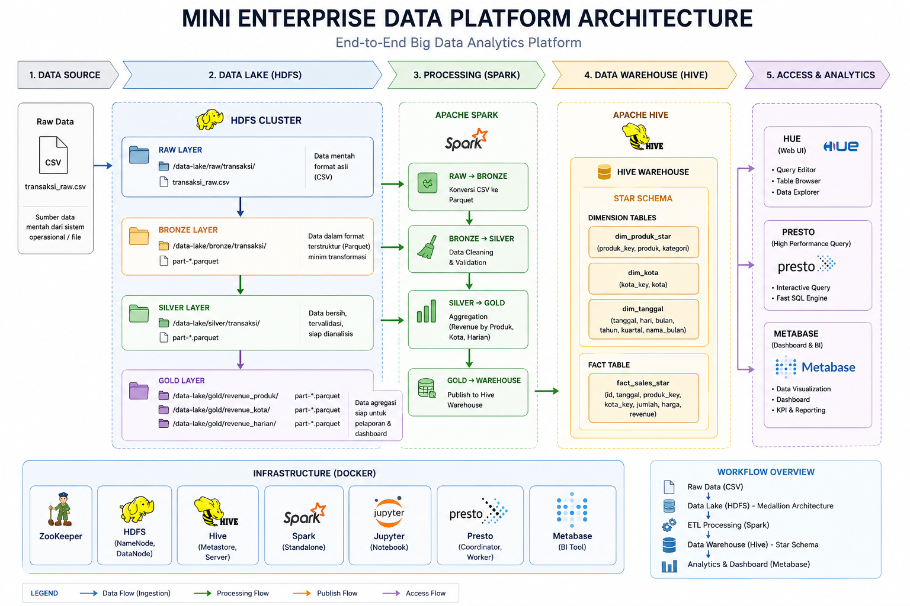
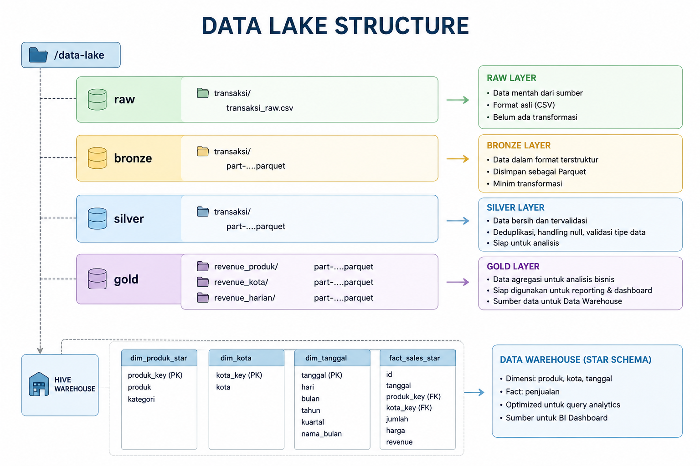
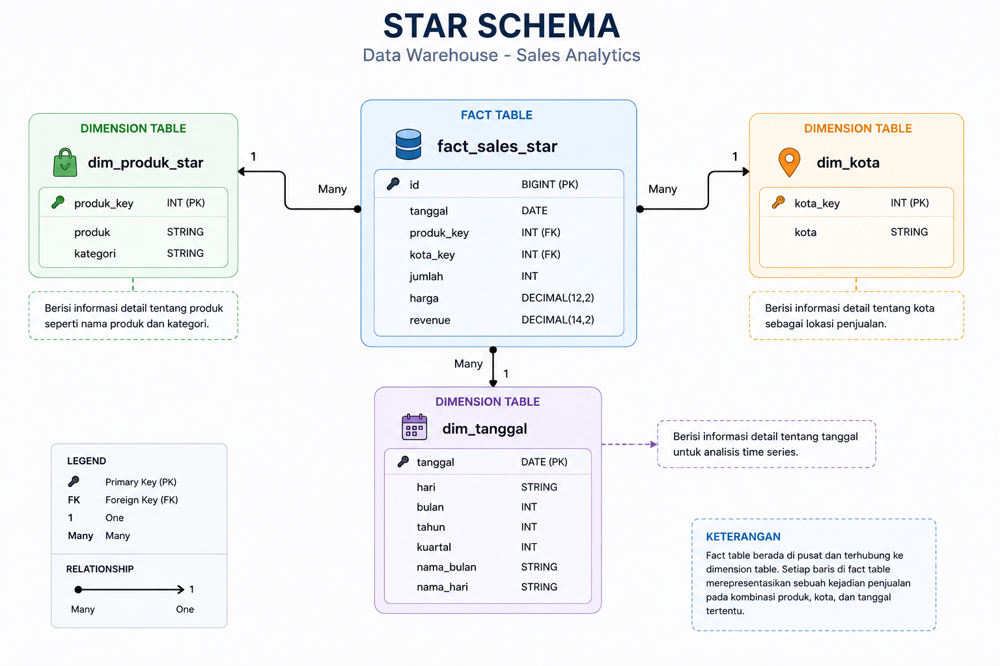
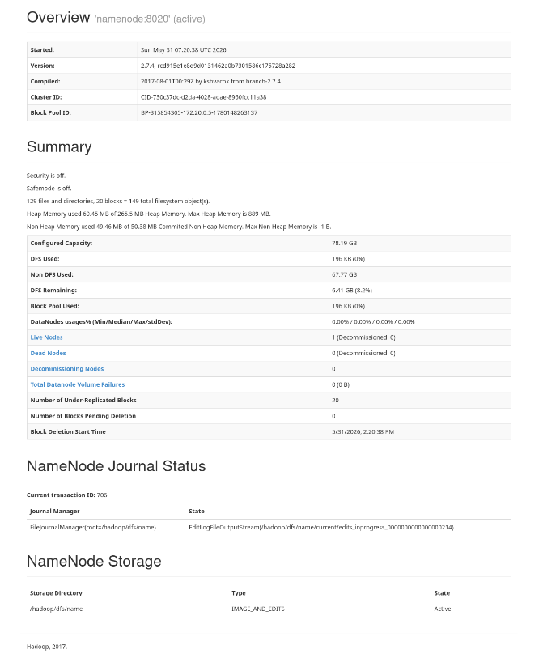
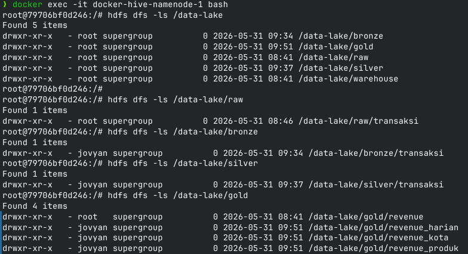
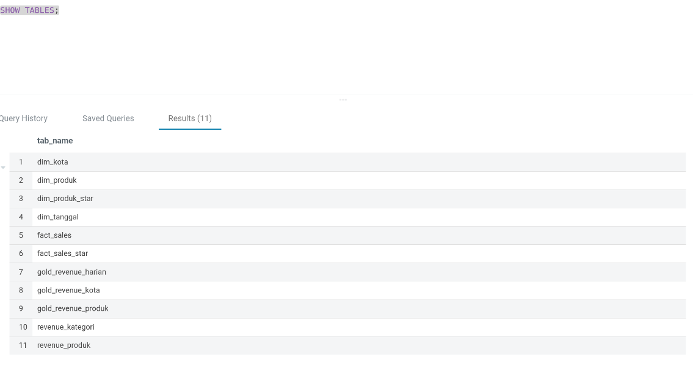
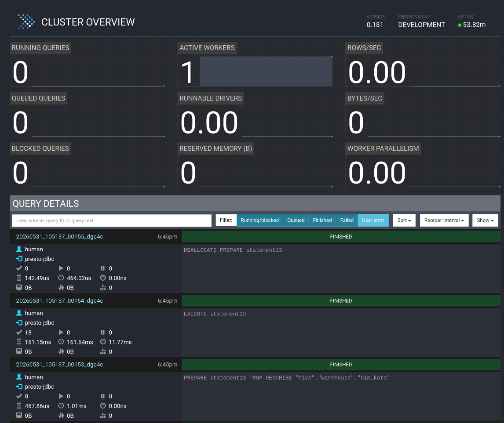
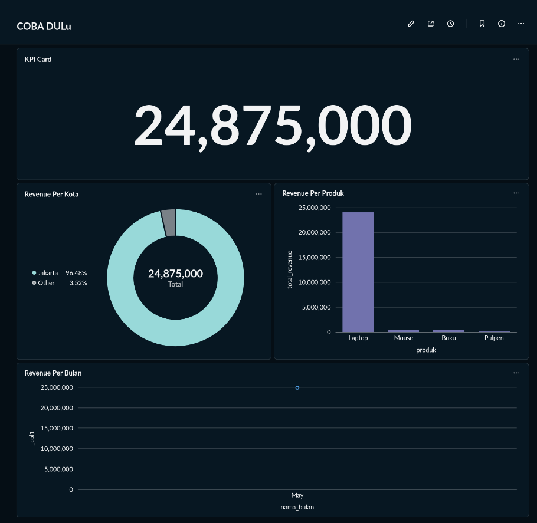

# Mini Enterprise Data Platform

End-to-End Big Data Analytics Platform built using Hadoop HDFS, Apache Hive, Apache Spark, Presto, Hue, Metabase, and Docker.

---

## Overview

This project demonstrates the implementation of a modern data platform that integrates Data Lake, ETL, Data Warehouse, and Business Intelligence components into a single ecosystem.

The platform follows a Medallion Architecture (Raw → Bronze → Silver → Gold) and implements a complete analytical workflow from raw CSV ingestion to dashboard visualization.

The objective of this project is to provide a hands-on implementation of core Data Engineering concepts including distributed storage, ETL pipelines, dimensional modeling, SQL analytics, and business intelligence reporting.

---

## Architecture



The platform consists of several integrated layers:

| Layer                 | Technology     |
| --------------------- | -------------- |
| Storage               | Hadoop HDFS    |
| Processing            | Apache Spark   |
| Metadata Management   | Hive Metastore |
| Data Warehouse        | Apache Hive    |
| Query Engine          | Presto         |
| SQL Interface         | Hue            |
| Dashboard & Analytics | Metabase       |
| Containerization      | Docker         |

---

## Data Lake Architecture



The project implements a Medallion Data Lake Architecture.

### Raw Layer

Stores original source data without modifications.

```text
/data-lake/raw
```

Example:

```text
transaksi_raw.csv
```

---

### Bronze Layer

Stores structured data converted from CSV into Parquet format.

```text
/data-lake/bronze
```

Purpose:

* Preserve original records
* Improve storage efficiency
* Improve read performance

---

### Silver Layer

Stores cleaned and validated data.

```text
/data-lake/silver
```

Transformations:

* Duplicate removal
* Null handling
* Data type validation
* Data standardization
* Data quality checks

---

### Gold Layer

Stores business-ready datasets for analytics and reporting.

```text
/data-lake/gold
```

Generated datasets:

* revenue_produk
* revenue_kota
* revenue_harian

---

## ETL Pipeline

The platform implements an end-to-end ETL workflow.

```text
CSV Raw Data
      │
      ▼
Raw Layer (HDFS)
      │
      ▼
Bronze Layer
      │
      ▼
Silver Layer
      │
      ▼
Gold Layer
      │
      ▼
Hive Warehouse
      │
      ▼
Metabase Dashboard
```

---

## Notebook Workflow

| Notebook                   | Description                             |
| -------------------------- | --------------------------------------- |
| 01_raw_to_bronze.ipynb     | Load CSV data into HDFS Bronze Layer    |
| 02_bronze_to_silver.ipynb  | Clean and validate data                 |
| 03_silver_to_gold.ipynb    | Generate business-ready datasets        |
| 04_gold_to_warehouse.ipynb | Publish datasets to Hive Warehouse      |
| 05_build_star_schema.ipynb | Build dimensional model and Star Schema |

---

## Data Warehouse Design

### Star Schema



The warehouse follows a dimensional model using one fact table and multiple dimension tables.

---

### Fact Table

#### fact_sales_star

| Column     |
| ---------- |
| id         |
| tanggal    |
| produk_key |
| kota_key   |
| jumlah     |
| harga      |
| revenue    |

Purpose:

* Store transaction records
* Store business metrics
* Support analytical queries

---

### Dimension Tables

#### dim_produk_star

| Column     |
| ---------- |
| produk_key |
| produk     |
| kategori   |

Purpose:

* Product categorization
* Product analysis

---

#### dim_kota

| Column   |
| -------- |
| kota_key |
| kota     |

Purpose:

* Geographical analysis
* Regional performance analysis

---

#### dim_tanggal

| Column     |
| ---------- |
| tanggal    |
| hari       |
| bulan      |
| tahun      |
| kuartal    |
| nama_bulan |

Purpose:

* Time-series analysis
* Trend analysis
* Period comparison

---

## Analytical Tables

The following aggregated tables are generated from the Gold Layer.

### gold_revenue_produk

Revenue aggregated by product.

### gold_revenue_kota

Revenue aggregated by city.

### gold_revenue_harian

Revenue aggregated by transaction date.

---

## SQL Analytics Examples

### Revenue by Product

```sql
SELECT
    p.produk,
    SUM(f.revenue) AS total_revenue
FROM warehouse.fact_sales_star f
JOIN warehouse.dim_produk_star p
ON f.produk_key = p.produk_key
GROUP BY p.produk
ORDER BY total_revenue DESC;
```

### Revenue by City

```sql
SELECT
    k.kota,
    SUM(f.revenue) AS total_revenue
FROM warehouse.fact_sales_star f
JOIN warehouse.dim_kota k
ON f.kota_key = k.kota_key
GROUP BY k.kota
ORDER BY total_revenue DESC;
```

### Daily Revenue

```sql
SELECT
    tanggal,
    SUM(revenue) AS total_revenue
FROM warehouse.fact_sales_star
GROUP BY tanggal
ORDER BY tanggal;
```

---

## Screenshots

### Hadoop HDFS



The Hadoop NameNode interface showing cluster health and storage information.

---

### Data Lake Structure



The implemented Medallion Architecture in HDFS.

---

### Hue Warehouse



Hue Warehouse tables and metadata.

---

### Presto Query Engine



Presto query engine connected to Hive Warehouse.

---

### Metabase Dashboard



Business Intelligence dashboard built on top of the warehouse.

---

## Project Structure

```text
mini-enterprise-data-platform/
│
├── README.md
├── CHANGELOG.md
├── PROJECT_STRUCTURE.md
├── requirements.txt
│
├── transaksi_raw.csv
│
├── architecture/
│   ├── data_lake_structure.png
│   ├── platform_architecture.png
│   └── star_schema.png
│
├── notebooks/
│   ├── 01_raw_to_bronze.ipynb
│   ├── 02_bronze_to_silver.ipynb
│   ├── 03_silver_to_gold.ipynb
│   ├── 04_gold_to_warehouse.ipynb
│   └── 05_build_star_schema.ipynb
│
├── sql/
│   ├── 01_show_tables.sql
│   ├── 02_revenue_produk.sql
│   ├── 03_revenue_kota.sql
│   └── 04_revenue_harian.sql
│
├── docs/
│   ├── installation.md
│   ├── data_lake_pipeline.md
│   ├── star_schema.md
│   └── dashboard.md
│
├── screenshots/
│   ├── 01_hdfs_namenode.png
│   ├── 02_hdfs_data_lake_structure.png
│   ├── 03_hue_shows_tables.png
│   ├── 04_presto_ui.png
│   └── 05_metabase_dashboard.png
│
└── docker/
    ├── docker-hive/
    ├── hue-lab/
    ├── spark-lab/
    ├── jupyter-lab/
    └── metabase-lab/
```

---

## Requirements

Install Python dependencies:

```bash
pip install -r requirements.txt
```

requirements.txt

```text
pyspark
pandas
numpy
jupyter
```

---

## Current Features

* Hadoop HDFS Data Lake
* Medallion Architecture
* Apache Spark ETL Pipeline
* Hive Data Warehouse
* Hive Metastore
* Star Schema Modeling
* SQL Analytics
* Presto Query Engine
* Hue SQL Interface
* Metabase Dashboard
* Docker-Based Deployment

---

## Future Improvements

Planned enhancements:

* Apache Airflow Workflow Orchestration
* Spark on YARN
* Kafka Streaming Pipeline
* Real-Time Analytics
* Feature Store Implementation
* Machine Learning Integration
* Incremental ETL Processing
* Data Quality Monitoring

---
